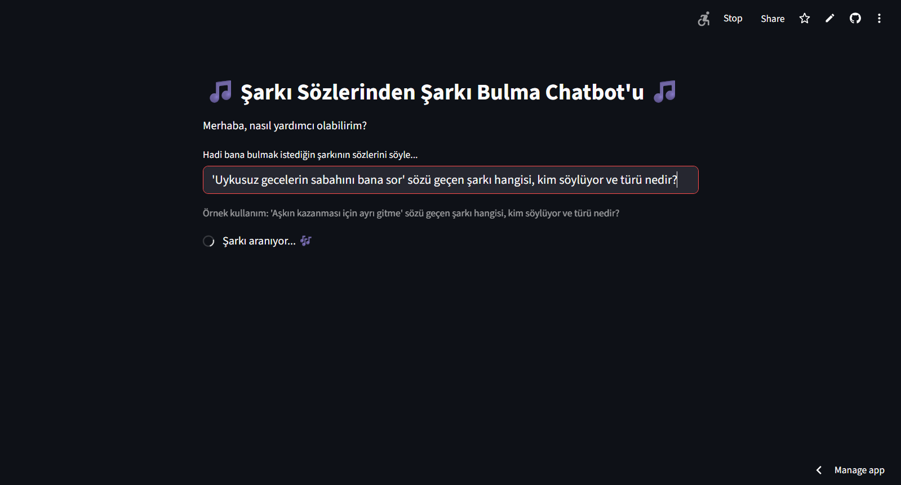

# Akbank GenAI Bootcamp: Şarkı Sözlerinden Şarkı Bulma Chatbot'u

Bu proje, Akbank GenAI Bootcamp: Yeni Nesil Proje Kampı kapsamında geliştirilmiş RAG (Retrieval-Augmented Generation) tabanlı bir chatbot uygulamasıdır. Kullanıcının girdiği şarkı sözü parçacıklarına dayanarak ilgili şarkının adını, sanatçısını ve türünü bulmayı amaçlar.

## 1. Projenin Amacı

Projenin temel amacı, kullanıcılara sadece akıllarında kalan şarkı sözlerini yazarak o şarkıyla ilgili bilgilere (şarkı adı, sanatçı, tür) hızlıca ulaşmalarını sağlayan bir yapay zeka destekli araç sunmaktır. Bu, özellikle şarkının adını veya sanatçısını hatırlayamayan kullanıcılar için pratik bir çözüm sunar. RAG mimarisi kullanılarak, chatbot'un cevaplarının yalnızca sağlanan veri setindeki bilgilere dayanması ve uydurma (hallucination) yapmaması hedeflenmiştir.

## 2. Veri Seti Hakkında Bilgi

* **Kaynak:** Projede [Kaggle'daki "Turkish Music Spectograms" veri seti](https://www.kaggle.com/datasets/anil1055/turkish-music-spectograms)'nin içinde bulunan `Lyrics` klasöründeki Türkçe şarkı sözü `.txt` dosyaları kullanılmıştır.
* **İçerik:** Veri seti, farklı türlerde (Pop, Rock, Arabesk, Rap vb.) yüzlerce şarkının sözlerini içermektedir. Dosya yapısı `Lyrics/<Tür>/<Şarkı Adı>.txt` şeklindedir.
* **Hazırlık ve Zenginleştirme:**
    * Orijinal veri setinde yalnızca şarkı sözleri ve dosya yolundan elde edilen "tür" bilgisi bulunmaktadır. "Sanatçı" bilgisi mevcut değildi.
    * Projeyi daha işlevsel hale getirmek için, veri setindeki şarkıların büyük bir kısmını içeren manuel bir "Şarkı Adı: Sanatçı Adı" eşleştirme listesi (`user_text` değişkeni, Colab notebook'unda görülebilir) oluşturulmuştur.
    * Pandas kütüphanesi kullanılarak bu eşleştirme listesi ile veri seti zenginleştirilmiş ve her şarkıya ait sanatçı bilgisi eklenmiştir. Eşleşme bulunamayan şarkılar için sanatçı "Bilinmiyor" olarak etiketlenmiştir. *(Not: Test sırasında 'Ayrı Gitme' şarkısının sanatçısının yanlış girildiği fark edilmiş ve Colab notebook'undaki `user_text` listesi düzeltilmiştir.)*
* **Not:** Bootcamp kılavuzu gereği orijinal `.txt` dosyaları bu repoya eklenmemiştir. Ancak, bu verilerden oluşturulan ve RAG mimarisinin kullandığı vektör veritabanı (`chroma_db` klasörü) repoda mevcuttur.

## 3. Kullanılan Yöntemler (Çözüm Mimarisi)

Proje, **Retrieval-Augmented Generation (RAG)** mimarisi üzerine kurulmuştur ve **LangChain** kütüphanesi ile yönetilmektedir:

1.  **Veri İşleme ve Vektör Veritabanı (Colab):**
    * Yukarıda bahsedilen veri seti okundu, temizlendi ve sanatçı bilgisi ile zenginleştirildi (`Akbank_Bootcamp_Sarki_Chatbotu.ipynb`).
    * Her şarkı sözü, `RecursiveCharacterTextSplitter` kullanılarak anlamlı ve yönetilebilir parçalara (chunk) bölündü (`chunk_size=300, chunk_overlap=50`).
    * Parçalanan metinler, Hugging Face'den `sentence-transformers/all-MiniLM-L6-v2` modeli kullanılarak anlamsal vektörlere (embeddings) dönüştürüldü.
    * Bu vektörler ve ilişkili meta veriler (sanatçı, şarkı adı, tür), kalıcı bir **ChromaDB** vektör veritabanına (`chroma_db` klasörü) kaydedildi.

2.  **RAG Zinciri (LangChain Expression Language - LCEL):**
    * **Retriever (Getirici):** Kullanıcının sorgusu geldiğinde, `chroma_db` veritabanında bu sorguya anlamsal olarak en çok benzeyen **1 adet** (`k=1`) metin parçasını bulmak üzere yapılandırıldı. `k=1` ayarı, LLM'in alakasız bilgilerle kafasının karışmasını önlemek ve daha net cevaplar üretmek için özellikle seçildi.
    * **Prompt (Talimat Şablonu):** Bulunan metin parçasını (`context`) ve kullanıcının orijinal sorusunu (`question`) alarak LLM'e (Gemini) net bir talimat veren bir şablon oluşturuldu. Bu şablon, LLM'e cevabını *sadece* verilen bağlama dayandırmasını ve bağlamda cevap yoksa "Bu konuda bilgim yok." demesini emreder.
    * **LLM (Büyük Dil Modeli):** Google'ın `gemini-pro-latest` modeli (`temperature=0` ayarıyla, uydurmayı en aza indirmek için) kullanıldı. Model için gerekli API anahtarı, Streamlit Cloud'un Secrets yönetiminden güvenli bir şekilde alınmaktadır.
    * **Output Parser (Çıktı Ayrıştırıcı):** LLM'in cevabını temiz bir metin (string) formatına dönüştürür.

3.  **Web Arayüzü (Streamlit):**
    * Kullanıcının sorgu girebileceği, cevapları görebileceği ve proje hakkında bilgi alabileceği basit ve kullanıcı dostu bir web arayüzü `streamlit` kütüphanesi ile oluşturuldu (`app.py`). Arayüzde başlık ortalanmış, bilgilendirme metinleri ve örnek kullanım yönergeleri eklenmiştir.
    * API anahtarının güvenliği için `try-except` bloğu kullanılarak, canlı uygulamada anahtar Streamlit Cloud'un **Secrets** yönetiminden okunurken, lokalde çalıştırırken kullanıcıdan alınmaktadır.
    * Modelin ve veritabanının her sorguda yeniden yüklenmesini önlemek için Streamlit'in `@st.cache_resource` özelliği kullanılarak performans optimize edildi.

## 4. Elde Edilen Sonuçlar

* Geliştirilen chatbot, sağlanan veri setindeki şarkı sözlerine dayanarak şarkı adı, sanatçı ve tür bilgilerini başarılı bir şekilde döndürmektedir.
* `k=1` retriever ayarı ve net prompt talimatları sayesinde, modelin alakasız veya uydurma cevaplar verme olasılığı büyük ölçüde azaltılmıştır.
* Veritabanında bulunmayan bir söz veya bilgi sorulduğunda, chatbot tutarlı bir şekilde "Bu konuda bilgim yok." cevabını vermektedir.
* Streamlit arayüzü, chatbot'un kolayca test edilmesini ve kullanılmasını sağlamaktadır. Farklı API anahtarlarıyla yapılan testlerde karşılaşılan kota sorunları, uygun API anahtarı seçimi ve Streamlit Secrets kullanımıyla aşılmıştır.

## 5. Canlı Web Uygulaması

Uygulamanın canlı haline aşağıdaki linkten erişebilirsiniz:

**[Çalışan Uygulama Linki](https://akbank-chatbot-projem-cr2z7uyd9fnvbenghagkhm.streamlit.app/)**

### Örnek Kullanım

Uygulamanın kullanımı oldukça basittir:
1.  Ortadaki metin kutusuna bulmak istediğiniz şarkı sözünü yazın ve Enter'a basın.
2.  Chatbot, veritabanında ilgili şarkıyı arayacak ve bulursa sonucunu gösterecektir.

**Ekran Görüntüleri:**

*(Unutma: Aşağıdaki `images/...` yollarını kendi dosya adlarınla değiştirmen ve resimleri `images` klasörüne koyman lazım)*

*Uygulamanın İlk Açılış Ekranı:*


*Sorgu Girişi Örneği:*


*Başarılı Cevap Örneği:*


*Bulunamayan Bir Söz İçin Cevap:*


---

*(İsteğe Bağlı Bölüm: Kurulum ve Lokal Çalıştırma)*

### Kurulum ve Çalıştırma (Lokal)

Projeyi kendi bilgisayarınızda çalıştırmak için aşağıdaki adımları takip edebilirsiniz:

1.  **Repoyu Klonlayın:**
    ```bash
    git clone [https://github.com/EnesBugra05/akbank-chatbot-projem.git](https://github.com/EnesBugra05/akbank-chatbot-projem.git)
    cd akbank-chatbot-projem
    ```
2.  **Sanal Ortam Oluşturun ve Aktif Edin:**
    ```bash
    python -m venv venv
    # Windows için:
    .\venv\Scripts\activate
    # macOS/Linux için:
    # source venv/bin/activate
    ```
3.  **Gerekli Kütüphaneleri Yükleyin:**
    ```bash
    pip install -r requirements.txt
    ```
4.  **Uygulamayı Çalıştırın:**
    ```bash
    streamlit run app.py
    ```
5.  Uygulama açıldığında, sol kenar çubuğuna kendi Google API Anahtarınızı (Google AI Studio'dan alınmış) girmeniz istenecektir.

*(Not: Lokal çalıştırma için `chroma_db` klasörünün `app.py` ile aynı dizinde olması gerekmektedir. Bu klasör repoda mevcuttur.)*